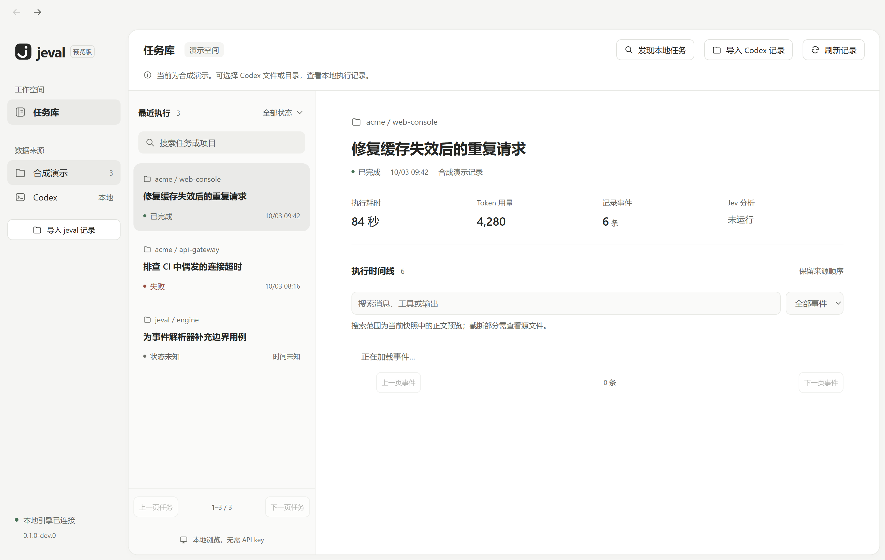

# M0 界面与交互说明

更新日期：2026-10-05。状态：沿用用户指定的 Apple Mac / Codex 简洁风格，B 的恢复/分页之上增加 C 的原生导入、完整快照导出范围、JSON/Markdown 操作与只读来源提示。C 检查依据见 [M3 进度](../development/m3-progress.md)，此前检查见 [M0 进度](../development/m0-progress.md)，完整视觉/缩放验收未完成。

截图来自本机验证的演示界面；其中任务、指标、工具测试输出和来源引用全部是合成样本，不代表真实 Codex 任务或当前仓库运行结果。

其他状态截图：[1000 宽度窗口](m0-desktop-compact.png)、[搜索空结果](m0-desktop-empty.png)。

Codex 导入：[导入信息与提示](codex-import.png)、[1000 宽度导入界面](codex-import-compact.png)。目录发现：[候选选择窗口](codex-scan.png)、[1000 宽度候选窗口](codex-scan-compact.png)。这些截图使用合成 JSONL 文件，不是真实私人会话。截图随最终目录包验证更新。

B 任务库：[1440 宽度分页与保存目录](persistent-library.png)、[1000 宽度离线恢复](persistent-library-compact.png)。全部为合成数据，源文件路径位于独立测试目录。

品牌区域现使用 jeval 原创 j / 核验勾形标志，与窗口及 Windows 程序图标一致，资源与生成方法见 [标志说明](branding.md)。

## 当前结构

界面采用浅灰应用背景、白色主面板和中性灰选中状态。左侧为工作空间与来源，中间为任务列表，右侧为执行详情。搜索与状态筛选位于列表顶部；顶栏提供发现本地任务、单文件导入与刷新。来源可在合成演示和 Codex 间切换，说明条展示已确认预览的持久化范围。保存目录可显式重扫/移除，详情可更新已登记记录。任务列表和详情独立滚动，详情正文限制最大宽度。

扫描只发现记录，完成、取消或达到扫描上限后弹出“选择要导入的记录”二级窗口。默认不选，左侧候选列表支持搜索与勾选，右侧展示标题、项目、时间、路径和首条消息预览；全选覆盖全部尚未导入候选，点击“导入所选”才加入任务库。关闭/Esc 不导入，扫描面板可重开候选窗口。已有记录提示“将更新已有记录”，本次已导入候选禁用。

使用原生 dialog 保持模态焦点与背景不可交互；弹窗高度随窗口缩放，概要/列表分别滚动，底部确认按钮保持可见。导入期间可取消且禁止关闭；状态查询失败在模态窗口内也提供重连入口。空候选、无搜索匹配、部分失败、配额拒绝、文件变化和取消都有文字反馈。任务库配额 20 条在确认前可见，超额整批不导入。

扫描面板保留范围和计数、前 30 项失败详情，最高 220px；扫描期间基础浏览仍可用。发现不刷新或改变任务库；所选导入结束后刷新。事件时间线增加关键词与类型筛选，展示匹配数、清空操作，保留原始序号和证据；查询范围明确为当前快照的正文预览。

主题样式位于 [global.css](../../apps/desktop/src/renderer/styles/global.css)，交互入口位于 [App.tsx](../../apps/desktop/src/renderer/app/App.tsx)，线性图标统一使用 [Icon.tsx](../../apps/desktop/src/renderer/components/Icon.tsx)。图标为本地 SVG，不依赖字体符号或远程资源。保留系统原生窗口控制，不添加装饰性 Mac 红黄绿按钮。

窗口顶部不再重复显示品牌与“Agent 工作台”文字，改为 40px 高的轻量导航栏，左侧是后退/前进。使用 Electron `titleBarStyle: hidden` 与原生 `titleBarOverlay`，保留 Windows 最小化、最大化和关闭按钮；空白区域可拖动，导航按钮使用 no-drag，安全区域避开系统控件。实现依据见 [Electron 标题栏文档](https://www.electronjs.org/docs/latest/tutorial/custom-title-bar)。任务栏/窗口元数据仍保留应用名称和图标。

箭头已可用于记录与来源的浏览历史：保留每次访问的来源、选中记录、筛选与任务分页位置；没有历史时禁用，后退后打开另一条记录会清除前进分支。筛选输入更新当前访问，不按每个字符新建历史。内存历史最多 100 项，应用退出清空；引擎重连保留当前选择。跨页选择通过 runs.get 单独读取元数据，不要求详情所在记录在当前列表页，不执行来源文件中的导航。

## 视觉规则

用户参考图用于确定简洁、明快、留白协调的视觉方向。当前仍在 Windows 运行；系统字体栈优先使用平台可用字体，没有打包或下载 Apple 字体，也不承诺不同系统文字渲染完全一致。

| 项目       | 当前规则                                                                                                                                       |
| ---------- | ---------------------------------------------------------------------------------------------------------------------------------------------- |
| 字体       | 系统 sans-serif；优先 -apple-system / BlinkMacSystemFont，Windows 回退 Segoe UI Variable / Segoe UI，中文回退 PingFang SC / Microsoft YaHei UI |
| 字号       | 正文和任务标题 14px，次级标题/操作 13px，辅助文字 12px；时间及版本 11px；详情标题 24px，窄窗口 22px                                            |
| 字重与行高 | 正文常规字重，标题 500–600；正文行高 1.8，减少细小且低对比度的文字                                                                             |
| 间距       | 使用 4/8/12/16/20/24/32/40px 变量；模块内 8–16px，段落及模块间 24–32px                                                                         |
| 圆角       | 控件 8px，列表选中项/工具输出/证据面板 12px，主面板 16px；只在需要分组或交互的位置使用                                                         |
| 配色       | 背景 #f5f5f3，主面板 #ffffff，选中 #eaeae7，正文 #262725，次级文字 #626560，辅助文字 #6b6e68                                                   |
| 强调色     | 绿色仅用于完成/在线标识，红色表示错误，蓝色表示键盘焦点；选中项使用中性灰                                                                      |
| 分隔       | 保留栏间及关键区段细分隔线，移除指标竖线、时间线竖线和多层装饰边框                                                                             |
| 布局       | 默认侧栏 208px、列表 304px，详情内容最大 800px、内边距 40px；窗口不超过 1150px 时为 180/260px、详情内边距 24px                                 |

浅灰背景上的搜索占位文字和选中项时间使用较深的次级文字颜色；保留原生控件语义、可见键盘焦点和减少动态效果偏好。以上不等于完整的无障碍验收。

| 行为/状态      | 当前实现                                                                                                   |
| -------------- | ---------------------------------------------------------------------------------------------------------- |
| 任务选择       | 显示选中状态，并加载对应运行事件                                                                           |
| 顶部前进/后退  | 在已访问记录和来源之间切换，保留筛选；控制禁用、前进分支和缺失记录回退                                     |
| 搜索与筛选     | 任务列表匹配标题/项目/来源；记录内搜索标题/正文/角色并组合事件类型，空结果可清除                           |
| 事件浏览       | 按来源顺序请求最多 50 条；上一页/下一页替换当前页，按返回字节预算与 nextOffset 翻页                        |
| 工具输出       | 默认收起，通过 details/summary 展开，按普通文本显示                                                        |
| 证据查看       | 演示展示虚拟序号；Codex 展示真实文件路径、物理行号与父事件，导入信息保留摘要；不自动打开或执行文件         |
| 缺失值         | 时间显示“时间未知”，耗时和 token 显示“未知”                                                                |
| 加载与错误     | 有加载提示、请求错误和事件重试；基础连接错误可显式重启引擎                                                 |
| 来源与分析提示 | Codex 支持显式文件导入、空态、取消、独立错误提示和重复导入更新；导入信息可展开查看兼容性提示，Jev 仍未运行 |
| 目录发现       | 原生目录选择、递归发现、候选选择/全选、取消和部分失败；保存/显式重扫/移除目录配置，启动不扫描              |
| 手动更新       | 完整重读已登记路径，成功后刷新当前快照；源文件离线或保存失败时提示旧快照保留                               |
| 基础键盘操作   | 使用原生按钮、输入框、选择框和折叠控件，设置可见焦点样式                                                   |
| 原生导出/导入  | 侧栏打开 JSON；详情核对当前快照全部事件及预览/来源范围后选择 JSON 或 Markdown；取消选择无成功提示          |
| 只读交换记录   | 单列只读标签，禁用本地更新并说明显式来源重新选择；导入错误、重复版本及版本冲突可见                         |

任务列表每页最多请求 10 条，详情每页最多请求 50 条；任务和事件都会按编码预算缩短页，使用返回的偏移和访问记录翻页，避免上一页固定减请求数量。翻页替换 DOM，筛选变化回第一页，证据面板随页清除。明确提示每事件正文预算 8 KiB、只搜索预览，没有原始文件备份。当前未使用虚拟列表；配额内合成分页检查不等于长日志性能基线。

## 已检查与待验收

C 的最终目录包通过 6 项 E2E，新增 JSON/Markdown 完整快照导出、选择器取消、来源保护、空白库只读再导入及重启，以及大元数据导致 2/2/1 页时的任务往返。1440 的 [导出范围](record-export.png) 与 1000 的 [只读导入](record-import-compact.png) 截图已查看；窄窗口通过详情滚动访问完整导出区，无页面横向溢出。样本全部合成，原生选择器返回值由测试替换，不代表系统选择器人工验收、缩放或读屏完成。实际依据见 [M3 进度](../development/m3-progress.md)。

2026-10-04 本轮 E2E 覆盖扫描不自动导入、默认不选、关闭/Esc、候选搜索/概要、单选和全选导入、重扫后确认更新、取消；继续覆盖记录内搜索、类型筛选、原始序号/证据与清空。1440/1000 宽度检查包含底部确认区可见性。样本为合成目录，原生选择器通过测试替换返回值，真实目录和权限错误人工流程未验收。最终检查结果见 [M0 进度](../development/m0-progress.md)。

此前 Codex 导入切片通过当时的 E2E（取消、错误、导入、重复导入、提示与证据、来源切换、当时的重启清空），B 已替换为重启保留。本轮最终 Windows 目录包通过 4 项 E2E，增加保存目录、手动更新、跨任务页选择和事件替换翻页；1440 与 1000 宽度截图已检查。测试使用合成文件和受控的文件选择器返回值，真实日志与原生对话框的人工验收仍待补充。

第二版使用现有 E2E 验证搜索、空结果、未知指标、失败输出、证据展开及显式引擎重启，并检查 1440 和 1000 宽度窗口。新增默认态、证据展开态、空结果态的截图输出，窄窗口保留横向溢出断言。2026-10-04 的类型检查、生产构建与最终目录包 E2E 均通过，截图已人工检查，详见 [验证记录](../development/m0-progress.md)。

仍需完成：可拖动面板、长日志虚拟化/性能基线、完整键盘与读屏验收、常用缩放比例、超长中英文路径、真实来源的加载/部分失败/缺失状态、对比页面和分析取消状态。当前不标记为 M1 视觉验收完成。

## 随功能交付的界面验收计划

沿用现有浅色主题、原生窗口按钮和候选选择交互，近期不另起整体视觉重做。按 [主规划](../jeval-development-plan.md) 的 B–F 切片逐步补齐，以下均为待实现或待验收要求。

| 切片            | 需要补齐的交互与检查                                                                                                                           |
| --------------- | ---------------------------------------------------------------------------------------------------------------------------------------------- |
| B：持久化任务库 | 重启恢复、保存/移除目录、手动更新、分页和正文范围提示已实现；完整故障 UI、权限和真实目录验收待补                                               |
| B/D：规模与正文 | 明确预览截断，按需查看已保存完整正文并说明搜索范围；加载事件保持有界渲染。用配额内样本建立基线，再验证扩容规模；补面板调整、键盘焦点与错误重试 |
| C：导出往返     | 已显示快照总量、预览/截断与来源路径范围、未自动脱敏；忙碌/取消选择/失败反馈和只读来源已实现，系统选择器人工流程及缩放验收仍待补                |
| D：更新         | 新候选默认不选；已登记记录显示更新状态，取消或失败仍能浏览旧快照；源文件丢失不把记录直接移除                                                   |
| E：标注/对比    | 标注明确所绑定快照，两份记录手动选择和独立滚动；更新后旧标注可理解，未知指标不计算伪差值；不要求自动事件对齐                                   |
| F：Jev          | 输入范围预览、无密钥、排队、取消、超时、证据不足与旧版本结果分别有状态；关闭分析仍能浏览、标注和导出                                           |

本地预览前检查实际数据长度、中文/英文/长路径、1440/1000 宽度及 Windows 100%/125%/150% 缩放。记录实际检查环境与问题，截图必须使用合成或获准公开的脱敏内容；既有两种宽度截图不能代替缩放、读屏或长日志验收。
